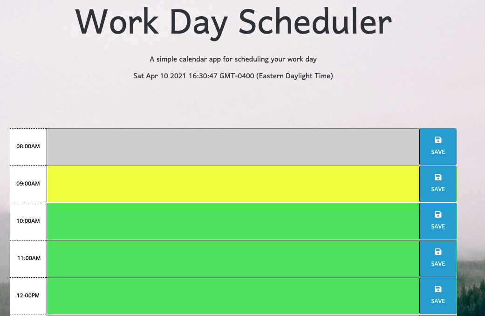

# Workday Planner

Link to live website: (https://abalcs.github.io/Day-Planner/)

## Tech Used
HTML, CSS, JavaScript, Moment.js

## Instructions
To create a day planner that covers typical business hours, displays the current time localized to the user, with updating time block colors to help keep the user on track, and which allows the user to save their input to their local storage.

## Purpose
Productivity and focus are important in all of our lives and yet it's such an easy thing to overlook. With its' user-friendly and simple design, this day planner will help keep your daily and hourly goals within reach!

## Directions
Wake up in the morning and take 15 minutes to plan out your day.  When you're finished, click the save button for each hour that you have something planned.  

That's it.  Simple, right?

## Issues
None.  Please share if you find errors :)
